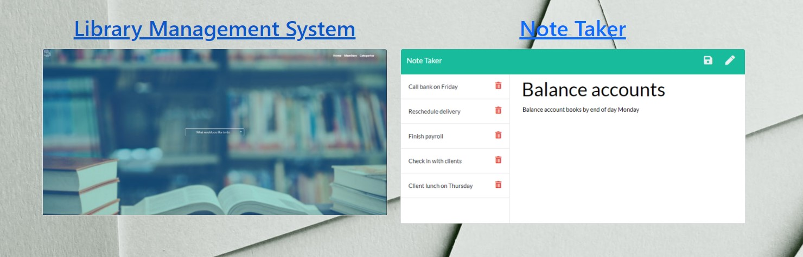

<h1 align="center", margin="5%">                      👨🏻‍💻  Portfolio 👨🏻‍💻 </h1>

<h1> Table of Contents </h1>

* [Demo](#Demo)

* [Questions](#Questions)

## Demo:

</h1>

## Questions:
   
<h1 align="center">

     For questions ❓ 

                              
[][1]
[][2]
[][3] 

[1]: https://github.com/fatihay53
[2]: https://www.linkedin.com/in/fatih-sultan-ay-211689181
[3]: mailto:f.sultanay@gmail.com

</h1>

